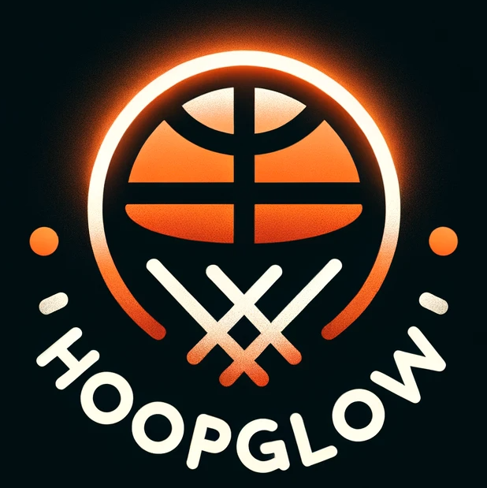

# HoopGlow: Interactive Basketball Backboard Lighting Display

HoopGlow is an LED lighting display for basketball backboards, enhancing the game experience by lighting up for different scores and game modes. This project combines custom hardware and software to create a unique, interactive basketball experience.

<!-- Logo -->
<p align="center">
   <!-- Adjust width as necessary -->
</p>

<!-- Badges -->
<p align="center">
  <a href="LICENSE.md"></a>

## Features

- LED array behind the basketball backboard.
- Different light-up modes for various point scores.
- Wireless triggering of the backboard.
- Customised CAD models for LED array brackets.

### Prerequisites

List what they need and how to install them:

- Software tools: if you have a working dev environment, you should be able to get up to speed.
- Hardware components: show up at the Makerspace (AC03 - 007) to get your hands on some of the LED strips and a testing jig very kindly set up in one of our community mentor's dorm room. If you need a controller, come find us.

### Installing

We will add a step-by-step guide to getting the development environment up and running in this section as the `main` branch starts getting populated.

## Git Commit Guidelines

To maintain a clear and understandable history, we follow these commonly accepted commit message practices*:

1. **Separate subject from body with a blank line.**
2. **Limit the subject line to 50 characters.**
3. **Capitalize the subject line.**
4. **Do not end the subject line with a period.**
5. **Use the imperative mood in the subject line.**
6. **Wrap the body at 72 characters.**
7. **Use the body to explain what and why vs. how.**

These rules are adopted from [that one Chris Beams article](https://cbea.ms/git-commit/). It encapsulates common best practices from the open-source software community with decent verbosity.

The *imperative mood* in rule 5 refers to a linguistic form that essentially makes a commit subject line a command or instruction, giving the message a directive tone. Imagine each commit message completes the sentence "This commit will...". For example, write "Add feature" instead of "Added feature" or "Adding feature."

Example:

```txt
Refactor subsystem X for readability

This simplifies the implementation of X and separates concerns for future enhancements. It primarily involves refactoring Y to improve modularity and prepare for the subsequent integration of feature Z.
```

The subject line "Refactor subsystem X for readability" completes the sentence "This commit will...refactor subsystem X for readability".

> Good reads on commit message discipline: [Chris Beams](https://cbea.ms/git-commit/), [git-scm guidelines](https://www.git-scm.com/book/en/v2/Distributed-Git-Contributing-to-a-Project#_commit_guidelines), [Peter Hutterer](http://who-t.blogspot.com/2009/12/on-commit-messages.html), and [Tim Pope](https://tbaggery.com/2008/04/19/a-note-about-git-commit-messages.html).

## Contributing

Please read `CONTRIBUTING.md` for details on our code of conduct, and the process for submitting pull requests to us.

## Acknowledgments

In the spirit of comradery and technological advancement, we pause for a moment to tip our hats to the artistic prowess of a new player on the court. The HoopGlow logo was a generous contribution from DALL-E, who dunked the perfect logo into our project's net. Hear, hear! 🎩🏀👏

## License

This project is licensed under the MIT License - see the `LICENSE.md` file for details.
